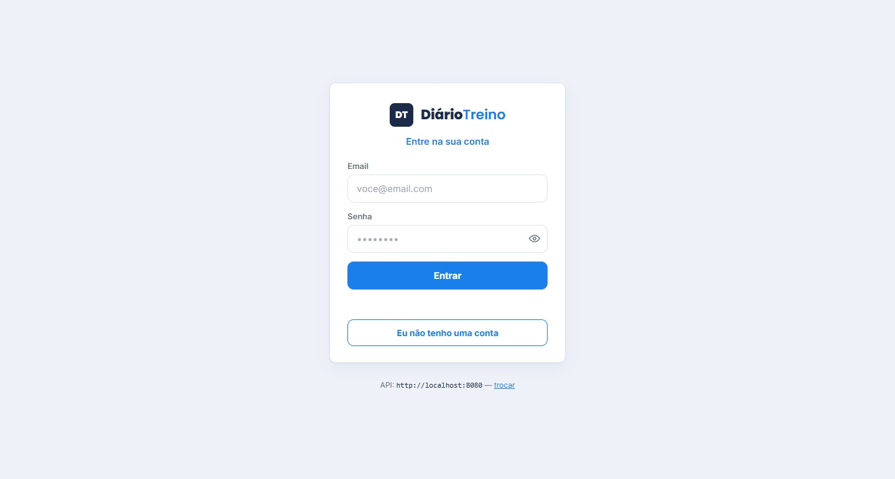
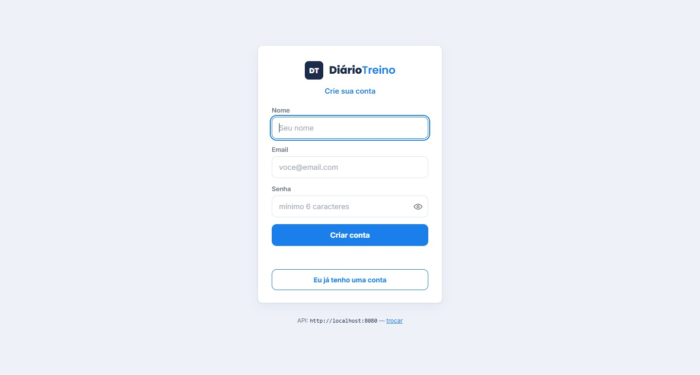
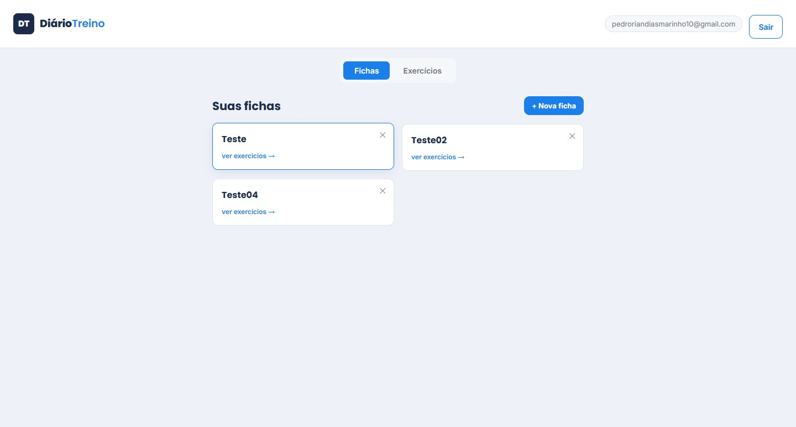

# 🏋️ Diário de Treino

API REST desenvolvida em **Java com Spring Boot**, com autenticação própria via **JWT**, banco de dados relacional em **MySQL** e front-end em **HTML, CSS e JavaScript**. O usuário cria uma conta, monta fichas de treino e organiza exercícios por grupo muscular, definindo séries e repetições planejadas para cada um.

Este foi meu primeiro projeto full stack construído do zero — da modelagem do banco de dados até a integração completa entre back-end e front-end.

---

## 📸 Screenshots

<!--
  Para adicionar suas imagens: crie uma pasta "screenshots" na raiz do
  repositório, coloque os arquivos .png/.jpg lá, e ajuste os nomes abaixo
  para bater com os arquivos que você subiu.
-->

**Tela de login**


**Tela de cadastro**


**Painel — fichas de treino**


**Painel — exercícios agrupados por grupo muscular**


---

## ✨ Funcionalidades

- Cadastro e login de usuário, com autenticação via JWT
- Cadastro de exercícios, organizados por grupo muscular
- Criação de fichas de treino, vinculadas automaticamente ao usuário logado
- Vínculo de exercícios a uma ficha, com séries e repetições planejadas
- Cada usuário só acessa suas próprias fichas — nunca as de outra pessoa

## 🛠️ Tecnologias utilizadas

**Back-end**
- Java 17
- Spring Boot (Web, Data JPA, Security, Validation)
- Spring Security + JWT para autenticação
- Hibernate (JPA) para o mapeamento objeto-relacional
- MySQL
- Maven
- Lombok

**Front-end**
- HTML, CSS e JavaScript puro
- Comunicação com a API via `fetch`

**Ferramentas**
- IntelliJ IDEA
- Git e GitHub
- Postman, para testes dos endpoints

## 🏗️ Arquitetura

O projeto segue uma arquitetura em camadas, separando responsabilidades:

```
Controller  → recebe as requisições HTTP
Service     → contém as regras de negócio
Repository  → acessa o banco de dados
Model       → representa as entidades (tabelas)
DTO         → define o formato dos dados que entram/saem da API
Security    → autenticação e proteção de rotas via JWT
```

## 🚀 Como rodar o projeto localmente

1. Clone o repositório
```
git clone https://github.com/Pedr-21/diario-treino.git
```

2. Crie um banco MySQL vazio
```sql
CREATE DATABASE diario_treino;
```

3. Configure as variáveis de ambiente `DB_PASSWORD` (senha do seu MySQL) na sua IDE ou no ambiente do sistema

4. Rode o projeto (via IntelliJ ou `./mvnw spring-boot:run`)

5. Acesse `http://localhost:8080/login.html` no navegador

## 📚 O que aprendi construindo este projeto

- Modelagem de banco de dados relacional, com relacionamentos entre entidades
- Autenticação e segurança de verdade, com Spring Security e JWT
- Arquitetura em camadas, separando responsabilidades no código
- Boas práticas com DTOs, evitando expor dados sensíveis nas respostas da API
- Integração real entre front-end e back-end, com token sendo enviado em cada requisição protegida
- Versionamento de código com Git, incluindo o uso de variáveis de ambiente para não expor credenciais

---

Desenvolvido por **Pedro Rian Dias Marinho**
